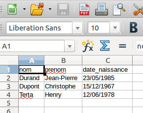

# Module Données structurées et leur traitement
## différents types de données structurées

On trouve énormément de données sur internet. Une partie de ces données sont publiques, par exemple le site data.gouv.fr récence un grand nombre de données publiques. Ces données sont librement réutilisables.

### Activité 17.1

Afin de découvrir ce qu'est "l'open data", nous allons utiliser le site data.gouv.fr. Résumez en quelques lignes ce que vous aurez appris en lisant la page suivante : [https://doc.data.gouv.fr/](https://doc.data.gouv.fr/){:target="_blank"}.
***

### Activité 17.2

Explorez pendant quelques minutes le site [data.gouv.fr](https://www.data.gouv.fr/fr/){:target="_blank"}. Recherchez les données "Opérations coordonnées par les CROSS" à l'aide du moteur de recherche proposé par le site

### Le format CSV

Vous pouvez constater que ces données sont au format csv.
***

Le format csv est très courant sur internet, nous allons l'étudier en premier.

Voici ce que nous dit Wikipédia sur le format CSV :

*Comma-separated values, connu sous le sigle CSV, est un format informatique ouvert représentant des données tabulaires sous forme de valeurs séparées par des virgules.*

Un fichier CSV est un fichier texte, par opposition aux formats dits « binaires ». Chaque ligne du texte correspond à une ligne du tableau et les virgules correspondent aux séparations entre les colonnes. Les portions de texte séparées par une virgule correspondent ainsi aux contenus des cellules du tableau.

Voici un exemple du contenu d'un fichier CSV :

```
nom,prenom,date_naissance
Durand,Jean-Pierre,23/05/1985
Dupont,Christophe,15/12/1967
Terta,Henry,12/06/1978
```

Je pense qu'il est évident pour vous que nous avons ici 3 personnes :

- Jean-Pierre Durand qui est né le 23/05/1985
- Christophe Dupont qui est né le 15/12/1967
- Henry Terta qui est né le 12/06/1978

### Activité  17.3

Donnez les différentes valeurs du descripteur "date_naissance"
***

ATTENTION :

La virgule est un standard pour les données anglo-saxonnes, mais pas pour les données aux normes françaises. En effet, en français, la virgule est le séparateur des chiffres décimaux. Il serait impossible de différencier les virgules des décimaux et les virgules de séparation des informations. C’est pourquoi on utilise un autre séparateur : le point-virgule (;). Dans certains cas cela peut engendrer quelques problèmes, vous devrez donc rester vigilants sur le type de séparateur utilisé.

Les tableurs, tels que "Calc" (Libre Office), sont normalement capables de lire les fichiers au format CSV. J'ai précisé "normalement" car certains tableurs gèrent mal le séparateur CSV "point-virgule" et le séparateur des chiffres décimaux "virgule".

### Activité 17.4

Après avoir téléchargé le fichier [ident_pointVirgule.csv](/asset/ident_pointVirgule.csv), ouvrez ce dernier à l'aide d'un tableur.

Si par hasard votre tableur ne gère pas correctement le fichier avec le séparateur "point-virgule", voici une version "séparateur virgule" du fichier : [ident_virgule.csv](v/asset/ident_irgule.csv)

Dans la suite, gardez toujours cet éventuel problème à l'esprit (surtout avec des données "made in France")
***

Vous devriez obtenir ceci :



Vous pouvez constater que les données sont bien "rangées" dans un tableau avec des lignes et des colonnes (voilà pourquoi on parle de données tabulaires.

Il est possible de trouver sur le web des données beaucoup plus intéressantes à traiter que celles contenues dans le fichier "ident_pointVirgule.csv" (ou "ident_virgule.csv"). Par exemple, le site [sql.sh](https://sql.sh/736-base-donnees-villes-francaises){:target="_blank"}, propose un fichier csv contenant des informations sur l'ensemble des communes françaises.

### Activité 17.5

Ouvrez le fichier [ville_point_virgule.csv](/asset/villes_point_virgule.csv) à l'aide d'un tableur (c’est une version légèrement modifiée de celle disponible sur le site sql.sh, j’y ai notamment ajouté des entêtes). En cas de problème avec votre tableur, voici une version "séparateur virgule" : [ville_virgule.csv](/asset/villes_virgule.csv) (attention le séparateur "décimal" est ici le point)
***

Comme vous pouvez le constater, nous avons 12 colonnes (et 36700 lignes si on ne compte pas l'entête !), voici la signification de ces colonnes :

- dep : numéro de département
- nom : nom de la commune
- cp : code postal
- nb_hab_2010 : nombre d'habitants en 2010
- nb_hab_1999 : nombre d'habitants en 1999
- nb_hab_2012 : nombre d'habitants en 2012 (approximatif)
- dens : densité de la population (habitants par kilomètre carré)
- surf : superficie de la commune en kilomètre carré
- long : longitude
- lat : latitude
- alt_min : altitude minimale de la commune (il manque des données pour certains territoires d'outre-mer)
- alt_max : altitude maximale de la commune (il manque des données pour certains territoires d'outre-mer)

### Activité 17.6

En vous aidant du fichier ouvert dans l'activité 17.5, déterminez l'altitude maximale et l'altitude minimale de votre commune.
***

### Le format JSON

Autre format de données très courant sur le "web", le JSON (JavaScript Object Notation). Le JSON fonctionne avec un système de paire clé/valeur.

Un "objet" est encadré par des accolades :

```
{cle_1 : val_1, cle_2 : val_2, cle_3 : val_3}
```
souvent, pour une question de lisibilité, on écrira :

```
{
cle_1 : val_1,
cle_2 : val_2,
cle_3 : val_3
}
```

Un fichier au format JSON peut regrouper un grand nombre d'objets :

[{
"nom" : "Durand",
"prenom" : "Jean-Pierre",
"date_naissance" : "23/05/1985"
},
{
"nom" : "Dupont",
"prenom" : "Christophe",
"date_naissance" : "15/12/1967"
},
{
"nom" : "Terta",
"prenom" : "Henry",
"date_naissance" : "12/06/1978"
}]


Ci-dessus, nous avons une liste (délimité par [ ]) contenant des objets.

La "valeur" d'une paire "clé/valeur" peut être une liste :

```
{
"nom" : "Durand",
"prenom" : "Jean-Pierre",
"date_naissance" : "23/05/1985"
"sport" : ["tennis", "football", "pétanque"]
}
```

Comme vous pouvez le constater, il est possible d'obtenir des structures de données très complexes avec le format JSON.

### Activité 17.7

Téléchargez le fichier [ident.json](/asset/ident.json) et ouvrez-le à l'aide d'un éditeur de texte.

Le site [https://www.data.gouv.fr/fr/](https://www.data.gouv.fr/fr/){:target="_blank"} propose un grand nombre de données au format JSON

### Activité 17.8

Ouvrez votre navigateur Web et tapez dans la barre d'adresse de ce navigateur l'adresse suivante :

```
https://calendrier.api.gouv.fr/jours-feries/metropole.json
```
Vous venez de récupérer la liste des jours fériés en France métropolitaine au format JSON.

Le 21 avril 2025 sera-t-il un jour férié ?

Et le 10 mai 2024 ?

Évidemment ces données ne sont pas exploitables en l'état, elles devront être mise en forme afin de pouvoir les utiliser par exemple dans un site Web.
***
