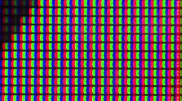
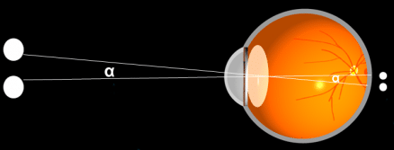

# Module la photographie numérique
## les images

Une image est composée de petits points appelés pixel. La définition d’une image vous donne le nombre de pixels qui compose l’image, par exemple une image de définition 800 x 600 (800 par 600), signifie que cette image est composée de 800 pixels en largeur et de 600 pixels en hauteur, soit en tout 800 x 600 = 480000 pixels.

Un pixel est composé de trois parties : une partie rouge, une partie verte et une partie bleue. À chaque pixel on associe donc 3 couleurs : le rouge, le vert et le bleu. On parle du canal rouge, du canal vert et du canal bleu d’un pixel (on parle de système RVB ou RGB en anglais). La théorie physique de la synthèse additive des couleurs (pour plus d’informations sur cette théorie, voir [ici](https://fr.wikipedia.org/wiki/Synth%C3%A8se_additive){:target="_blank"}) montre que la variation de l’intensité lumineuse de chaque canal permet d’obtenir un très grand nombre de couleurs. La valeur de l’intensité lumineuse associée à chaque canal de chaque pixel d’une image est très souvent comprise entre 0 et 255 (256 valeurs possibles). On codera donc un pixel à l'aide d'un triplet de valeur (par exemple "247,56,98"). La première valeur donnant l'intensité du canal rouge, la deuxième valeur donnant l'intensité du canal vert et la troisième valeur donnant l'intensité du canal bleu.

Quand on observe un pixel "à la loupe", on peut constater que le pixel est bien constitué de trois parties : une partie rouge, une partie verte, et une partie bleue (voir schéma ci-dessus). Et là, je suis sûr que vous vous posez une question fondamentale : quand nous regardons une image sur un écran d'ordinateur, nous "voyons" des pixels de différentes couleurs (jaune, mauve,...) et pas des pixels constitués de rouge, de vert et de bleu, pourquoi ?

Cela est dû à une limitation de notre oeil : son pouvoir séparateur !

Quand vous regardez 2 points très proches l'un de l'autre, l'oeil "voit" deux points si l'angle α (voir le schéma ci-dessus) est supérieur à 0,017°. En dessous de cette valeur, votre oeil "superposera" les 2 points, il ne verra pas deux, mais un seul point.

Un pixel est tellement petit que notre oeil superposera la partie rouge, la partie verte et la partie bleue du pixel, voilà pourquoi nous voyons des pixels de différentes couleurs.

### Activité 26.1

Combien de couleurs différentes est-il possible d’obtenir avec ce système RVB ?
***

### Activité 26.2

À l'aide de l'application proposée sur ce [site](http://www.proftnj.com/RGB3.htm){:target="_blank"}, faites varier les canaux rouge, vert et bleu (à l'aide des boutons + et des boutons -) afin d'obtenir différentes couleurs.

Comment obtenir du rouge ?

Comment obtenir du blanc ?

Comment obtenir du noir ?

Comment obtenir du jaune ?

Que se passe-t-il quand les trois canaux ont la même valeur (par exemple 125,125,125) ?
***

La taille est une autre caractéristique d'une image, elle correspond à la taille de l'image en cm ou en pouce (inch en anglais), toujours en utilisant la largeur et la longueur de l'image. Le papier photo vendu dans le commerce que l'on trouve le plus couramment fait 15 cm en largeur et 10 cm en hauteur. En cas d'impression sur ce papier, on obtiendra des photos de taille 15x10.

En combinant la taille et la définition d'une image, l'on obtient la résolution de cette image. La résolution d'une image est définie par le nombre de pixels par unité de longueur : nombre de pixels par cm ou plus couramment nombre de pixels par pouce (ppp ou dpi).

### Activité 26.3

Soit une image de définition 800x533 que l'on imprime sur du papier photo de taille 15x10 (en cm), calculez la résolution de cette image en ppp (rappel 1 pouce = 2,54 cm).
***

### Activité 26.4

Sachant que l'on estime que pour avoir une impression de qualité il faut atteindre une résolution de 300 ppp, calculez la définition minimale d'une image dans le cas d'une impression sur du papier photo 15 x 10.
***

### Activité 26.5

L'écran d'un smartphone a une résolution de 458 ppp, il affiche des images de définition 2436 x 1125. Calculez la taille de cet écran (largeur, hauteur) en cm.
***