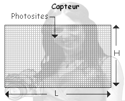

# Module la photographie numérique
##  capteur photo

Au siècle dernier on trouvait dans tous les appareils photo des pellicules. Une pellicule est une surface photosensible (surface qui réagit à la lumière) qui capte les informations lumineuses. Une fois la pellicule terminée (avec une pellicule on peut faire un nombre variable de photos : 6, 12, 24 ou 36), elle était extraite (je parle au passé, mais certains photographes utilisent encore des appareils photo avec pellicule) de l'appareil photo puis développée dans un laboratoire spécialisé grâce à des procédés chimiques, bref, tout cela était quelque peu complexe et quelque peu contraignant (par exemple une photo ratée, était tout de même développée et donc facturée...). Aujourd'hui, fini ces contraintes, on peut prendre autant de photos que l'on veut (dans la limite des capacités mémoires de l'appareil), effacer une photo si elle ne nous convient pas, imprimer uniquement certaines photos sur l'imprimante familiale. Cela a été rendu possible grâce au progrès de l'informatique et de l'électronique et plus particulièrement grâce à l'arrivée dans l'électronique grand public des capteurs photo.

Le capteur photo remplace la pellicule, un capteur photo est donc une surface photosensible. Le capteur photo est composé d'un grand nombre de photosites, chaque photosite va recevoir de la lumière, l'intensité lumineuse va être "convertie" en tension électrique grâce à un effet physique très complexe qui ne sera pas abordé ici : l'effet photoélectrique. Plus l'intensité lumineuse reçue par le photosite est importante plus le photosite produira une tension électrique importante.

La tension électrique produite par un photosite sera ensuite "converti" en nombre (on parle de numérisation), à chaque photosite on associera donc un nombre qui sera fonction de la quantité de lumière reçue par ce même photosite. C'est ces nombres qui seront "stockés" dans la mémoire de l'appareil photo.

Si l'on se contentait de ce système, nous aurions uniquement des images en niveau de gris (souvent appelé à tort image en "noir et blanc"). Afin de pouvoir gérer les couleurs, on rajoute donc un filtre coloré devant chaque photosite. Nous avons vu, dans la partie consacrée aux images, qu'il est possible de générer un grand nombre de couleurs uniquement à partir du rouge, du vert et du bleu, nous allons donc trouver 3 types de filtres : des filtres "rouges" (qui laisseront uniquement passer la lumière rouge), des filtres "verts" (qui laisseront uniquement passer la lumière verte) et des filtres "bleus" (qui laisseront uniquement passer la lumière bleue). À chaque photosite on associera soit un filtre rouge, soit un filtre vert, soit un filtre bleu. Il existe différentes façons d'agencer les filtres sur le capteur photo, mais nous ne rentrerons pas dans ces détails ici.

Comme vous pouvez le constater sur l'image ci-dessus, les filtres dits "Bayer" sont constitués de 50% de filtres vert, de 25% de filtre rouge et de 25% de filtre bleu afin d'imiter la physiologie de l'oeil humain (notre oeil est plus sensible au vert qu'au bleu et au rouge). Dans ce genre de capteur, 50% des photosites enregistrent uniquement la lumière verte, 25% des photosites enregistrent uniquement la lumière rouge et 25% des photosites enregistrent uniquement la lumière bleue.

Précédemment nous avons vu qu'une image est constituée de pixels, mais dans le cas d'une photo d'où vient l'information (canal rouge, canal vert et canal bleu) associée à chaque pixel de la photo ?

La réponse est simple : des photosites du capteur photo. L'association de 4 photosites (deux verts, un rouge et un bleu) donnera les informations qui permettront de créer un pixel de l'image.

Comme vous pouvez le constater sur le schéma ci-dessus, l'information produite par un photosite pourra être utilisée pour "construire" 2 pixels se trouvant l'un à côté de l'autre dans l'image finale.

### Activité 27.1

Rédigez à l'aide d'un traitement de texte un résumé de quelques lignes qui explique le fonctionnement du capteur d'un appareil photo numérique.