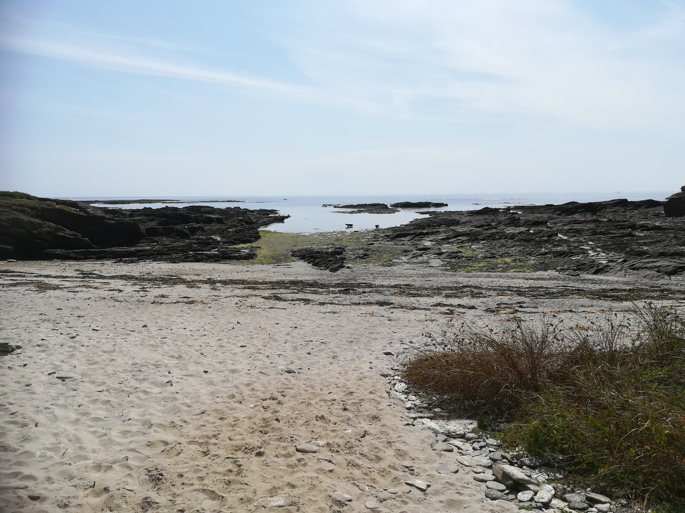
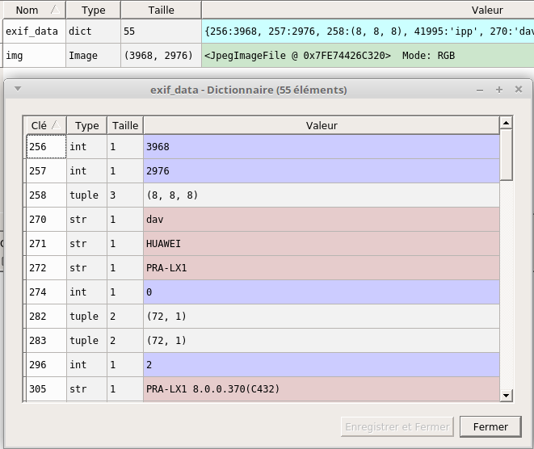
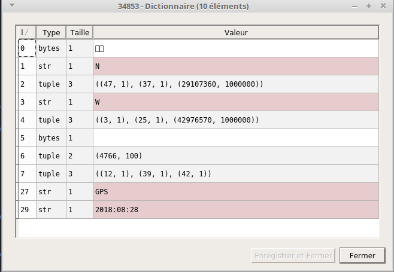

# Module la photographie numérique
##  métadonnées EXIF

Un fichier "image" issu d'un appareil photo numérique contient plus qu'une simple image. On trouve en effet des informations sur l'image elle-même (définition, résolution...) mais aussi des informations sur la prise de vue (date et heure, lieu...). Cette spécification des fichiers "image" d'un appareil photo numérique s'appelle EXIF (EXchangeable Image file Format). Ces données contenues dans un fichier "image" d'un appareil photo s'appellent des métadonnées.

La plupart des logiciels de retouche photo permettent de lire ces métadonnées. Nous n'allons pas utiliser ce type de logiciel, nous allons plutôt écrire un petit programme Python (plus précisément, nous utiliserons la bibliothèque Python "PIL").

### Activité 29.1

Créez un dossier nommé "exif", enregistrez l'image suivante dans ce dossier exif:

 

(pour enregistrer l'image : clic droit, "Enregistrer l'image sous").
***

### Activité 29.2

En utilisant le logiciel Spyder3, saisissez et testez le programme suivant (il faudra enregistrer le fichier contenant ce programme dans le dossier "exif" ) :

```python
import PIL.Image
img = PIL.Image.open('photo.jpg')
exif_data = img._getexif()
```
Après avoir exécuté le programme, utilisez l'"Explorateur de variables" de Spyder, pour analyser le contenu de la variable "exif_data", vous devriez avoir quelque chose qui ressemble à cela :


***

### Activité 29.3

Comme vous pouvez le constater, nous avons un système clé:valeur (à chaque clé correspond une valeur). Les clés sont "codées" par des nombres, pour comprendre la signification de ces nombres, consultez le site [http://www.exiv2.org/tags.html](http://www.exiv2.org/tags.html)

En vous aidant du site web cité ci-dessus, essayez de trouver les informations suivantes pour l'image [photo.jpg](asset/photo.jpg) :

- la largeur de l'image en pixel
- la hauteur de l'image en pixel
- le fabricant du matériel
- la date et l'heure de la prise de vue

La clé "34853" n'est pas tout le temps présente puisqu'il s'agit des coordonnées (latitude, longitude) de la prise de vue, il faut donc que l'appareil photo intègre un GPS (ce qui est le cas des smartphones), si nous double-cliquons sur cette clé "34853", nous obtenons les informations suivantes :



Les lignes 1, 2, 3 et 4 vont particulièrement nous intéresser :

- ligne 1 : précise que nous sommes dans l'hémisphère Nord
- ligne 2 : nous avons la latitude ((47, 1), (37, 1), (29107360, 1000000)) nous avons ici une latitude en degrés, minute, seconde (ici : 47 degrés 37 minutes et 29,107360 secondes, aussi noté 47°37'29,107360")
- ligne 3 : précise que nous sommes à l'ouest (W) du méridien de Greenwich
- ligne 4 : nous avons la longitude ((3, 1), (25, 1), (42976570, 1000000)) ici aussi la longitude est donnée en degrés, minute, seconde (ici : 3°25'42,976570")

Pour convertir des (degrés, minute, seconde aussi noté DMS) en "degrés décimaux" (DD) (unité que nous avons utilisée dans le module "cartographie"), il faut appliquer la formule suivante :

```
DD = degrés+(minute/60)+(seconde/3600)
```
ATTENTION : pour que la conversion soit correcte, il faut ajouter un signe moins devant la longitude au format DD si nous sommes situés à l'ouest du méridien de Greenwich.
***

### Activité 29.4

En vous aidant de ce qui a été expliqué ci-dessus et de ce que vous avez vu dans le module "cartographie", écrivez un programme Python permettant de générer une carte Open Street Map avec un marqueur situé à l'endroit où a été prise la photo *photo.jpg*
***

### Activité 29.5

Recommencez ce qui a été demandé dans l'activité 29.4 avec, par exemple, une photo prise avec votre smartphone.
***

