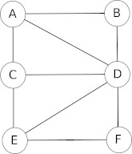
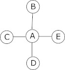
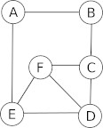

# Module réseaux sociaux
## Les graphes

Imaginez un réseau social ayant 6 abonnés (A, B, C, D, E et F) où :

- A est ami avec B, C et D
- B est ami avec A et D
- C est ami avec A, E et D
- D est ami avec tous les autres abonnés
- E est ami avec C, D et F
- F est ami avec E et D

La description de ce réseau social, malgré son faible nombre d'abonnés, est déjà quelque peu rébarbative, alors imaginez cette même description avec un réseau social comportant des millions d'abonnés !

Il existe un moyen plus "visuel" pour représenter ce réseau social : on peut représenter chaque abonné par un cercle (avec le nom de l'abonné situé dans le cercle) et chaque relation "X est ami avec Y" par un segment de droite reliant X et Y ("X est ami avec Y" et "Y est ami avec X" étant représenté par le même segment de droite).

Voici ce que cela donne avec le réseau social décrit ci-dessus :

Ce genre de figure s'appelle un graphe. Les graphes sont des objets mathématiques très utilisés, notamment en informatique. Les cercles sont appelés des sommets et les segments de droites des arêtes.

### Activité 9.1

Construisez un graphe de réseau social à partir des informations suivantes :

- A est ami avec B et E
- B est ami avec A et C
- C est ami avec B,F et D
- D est ami avec C,F et E
- E est ami avec A,D et F
- F est ami avec C, D et E
***

Voici quelques définitions sur les graphes :

**chaîne** : Dans un graphe, une chaîne reliant un sommet x à un sommet y est définie par une suite finie d'arêtes consécutives, reliant x à y.

exemple : Dans le graphe donné ci-dessus, A-D-E-C est une chaîne

**distance entre 2 sommets** : La distance entre deux sommets d'un graphe est le nombre minimum d'arêtes d'une chaîne allant de l'un à l'autre.

exemple : dans le graphe ci-dessus, la distance entre le sommet A et le sommet F est de 2 (chaîne A-D-F). ATTENTION : on parle bien du nombre minimum d'arêtes, A-D-E-F est aussi une chaîne entre A et F mais dans ce cas, nous avons 3 arêtes.

**excentricité** : L'excentricité d'un sommet est la distance maximale existant entre ce sommet et les autres sommets du graphe.

exemple 1 : Toujours dans le graphe ci_dessus : distance (A-B) = 1 ; distance (A-C) = 1 ; distance (A-D) = 1 ; distance (A-E) = 2 ; distance (A-F) = 2 ; nous pouvons donc dire que la distance maximale existant entre le sommet A et les autres sommets du graphe est de 2 (distance (A-E) et distance (A-F)). Nous pouvons donc dire que l'excentricité de A est de 2.

exemple 2 : distance (D-A) = 1 ; distance (D-B) = 1 ; distance (D-C) = 1 ; distance (D-E) = 1 ; distance (D-F) = 1 ; nous pouvons donc dire que l'excentricité de D est de 1.

**centre** : On appelle centre d'un graphe, le sommet d'excentricité minimale (le centre n'est pas nécessairement unique).

exemple : Dans le graphe ci-dessus tous les sommets ont une excentricité de 2 à l'exception du sommet D qui a une excentricité de 1, nous pouvons donc affirmer que le centre du graphe 1 est le sommet D

**rayon** : On appelle rayon d'un graphe G, l'excentricité d'un centre de G.

exemple : D a une excentricité de 1, c'est le centre du graphe 1, nous pouvons donc dire que le rayon du graphe ci-dessus est de 1.

**diamètre** : On appelle diamètre d'un graphe G, la distance maximale entre deux sommets du graphe G.

exemple : Dans le graphe ci-dessus la distance maximale entre 2 sommets est de 2, nous pouvons donc dire que le diamètre du graphe est de 2.

### Activité 9.2

Soit le graphe suivant (graphe 2) :

Déterminez le (ou les) centre(s) du graphe 2, en déduire le rayon du graphe 2. Déterminez le diamètre du graphe 2.

### Activité 9.3

Soit le graphe suivant (graphe 3) :

Déterminez le (ou les) centre(s) du graphe 3, en déduire le rayon du graphe 3. Déterminez le diamètre du graphe 3.