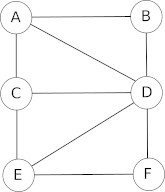

# Fiche de révision
## Réseaux sociaux : les graphes

**Ce qu’il faut savoir**

Il est souvent possible de représenter un réseau social par un objet mathématique appelé graphe. Un graphe est composé de sommets et d’arêtes

Vous devez connaitre les définitions des termes suivants (voir l'activité 9) :

- excentricité
- centre
- rayon
- diamètre

**Ce qu’il faut savoir faire**

Vous devez être capable de déterminer les grandeurs définies ci-dessus sur n’importe quel graphe.